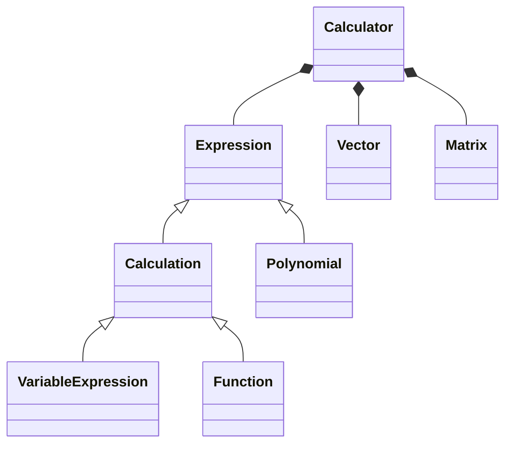

# 可编程计算器

**刘琦     2020201613**

## 一、需求分析

1. 实现一个具有交互界面的计算器，可以完成不同的数据处理或计算要求。
2. 简单表达式运算，计算输出结果。
3. 带单变量的表达式运算，可以重复给出不同的变量值，并计算输出相应结果。
4. 任意同维度的两个向量运算，完成包括加法、减法、余弦相似度等计算，输出结果。
5. 一元多项式运算，完成包括加法、减法、乘法、导数(包括任意阶)等计算，输出结果。
6. 定义并运行简单函数。
7. 矩阵运算，包括加、减、乘、转制、特征值、行列式的值等矩阵基本运算，输出结果。

## 二、概要设计

### 0 开发环境

本项目在 Windows 系统下开发使用 c++ 语言开发，使用 CMake 生成项目。

### 1 设计思路

考虑到简单表达式、单变量表达式、函数具有一定的相似性、在解析字符串的过程中也可以一定程度上复用代码，因此采用了继承的方式。而向量和矩阵的功能独立实现。最后将这些相对独立的功能统一集成到计算器类 ```Calculator``` 中。

## 三、详细设计

首先在```defines.c```文件中进行一些全局的宏定义如下：

```c++
typedef enum
{
    SUCCESS,
    ERROE,
    INVALID_INPUT,
    INVALID_OPERATOR,
    INVALID_MODE,
    ILLEGAL_OPERATION,
    TYPE_ERROR,
    OUT_OF_RANGE
} status;

typedef enum
{
    BASIC_MODE = 1,
    VARIABLE_MODE,
    POLY_MODE,
    VECTOR_MODE,
    MATRIX_MODE,
    FUNCTION_MODE
} Mode;
```

UML类图如下：



各部分类以及成员函数的定义的代码如下：

### 0 表达式虚基类

```c++
class Expression
{
public:
    Expression() {}
    Expression(const Expression& other) {}
    ~Expression() {}
    virtual status input() { return SUCCESS; };
    virtual status output() { return SUCCESS; };
    virtual status parse() { return SUCCESS; };
};
```

### 1 简单表达式

```c++
class Calculation : public Expression 
{
public:
    Calculation();
    Calculation(const string &raw);
    Calculation(const Calculation &other);
    ~Calculation();
    status input();				// 完成表达式的输入
    status output();			// 输出结果
    status parse();				// 解析并运算表达式，将结果存储在 value 中
    Number parse(string str);	// 直接解析并运算表达式，返回结果
    Number get_value() const;	// 返回存储的上一次运算的结果
    Calculation& operator=(const Calculation &other);
    friend std::ostream& operator<<(std::ostream &out, Calculation &obj);
    friend std::istream& operator>>(std::istream &in, Calculation &obj);
private:
    string raw;
    Number value;
};
```

### 2 单变量表达式

```c++
class VariableExpression : public Calculation
{
public:
    VariableExpression();
    VariableExpression(const string &raw);
    VariableExpression(const VariableExpression &other);
    ~VariableExpression();
	status input();						// 完成表达式的输入
    status output();					// 输出结果
    status parse();						// 解析并运算表达式，将结果存储在 value 中
    status set_var_name(string name);	// 设置变量名
    status set_var_value(Number value);	// 设置变量值
    Number get_var_value();				// 返回变量值
    Number get_value() const;			// 返回存储的上一次运算的结果
    status replace(string &str, string _old, string _new="");
    VariableExpression& operator=(const VariableExpression &other);
    friend std::ostream& operator<<(std::ostream &out, VariableExpression &obj);
    friend std::istream& operator>>(std::istream &in, VariableExpression &obj);
private:
    string raw;
    string var_name;
    Number var_value;
    Number value;
};
```

### 3 向量

```c++
class Vector
{
public:
    Vector(size_t n);
    Vector(const Vector &other);
    ~Vector();
    status input();
    status from_str(string raw);
    Vector& operator=(const Vector &other);
    Vector& operator+(const Vector &other);
    Vector& operator-(const Vector &other);
    Number operator*(const Vector &other);
    friend std::istream& operator>>(std::istream &in, Vector &obj);
private:
    Number *data;
    size_t size;
};
```

### 4 多项式

```c++
typedef struct PolyItem PolyItem;
typedef PolyItem* PolyNode;

struct PolyItem
{
    Number c;
    int power;
    PolyNode next;
};

class Polynomial : public Expression
{
public:
    Polynomial();
    Polynomial(const string &raw);
    Polynomial(const Polynomial &other);
    ~Polynomial();
    status input();
    status output();
    status parse();					// 解析字符串，存储到链表实现的多项式中
    status insert(PolyNode p);		// 在头结点处插入一个新结点
    status set_null();				// 将多项式置为空并释放内存，在析构函数和赋值操作中使用
    status sort();					// 将多项式按次数从高到低排序
    Polynomial& operator=(const Polynomial &other);
    Polynomial& operator+(const Polynomial &other);
    Polynomial& operator-(const Polynomial &other);
    Polynomial& operator*(const Polynomial &other);
    Polynomial& diff(int y);		// 多项式求导
    friend std::ostream &operator<<(std::ostream &out, const Polynomial &obj);
    friend std::istream &operator>>(std::istream &in, const Polynomial &obj);
    string parse2str();				// 将存储的多项式输出成字符串形式
    operator string();
private:
    string raw;
    PolyNode head;
};
```

### 5 矩阵

```c++
class Matrix
{
public:
    Matrix(size_t r, size_t c);             // 非方阵构造
    Matrix(size_t r, size_t c, double val); // 赋初值val
    Matrix(size_t n);                       // 方阵构造
    Matrix(const Matrix &rhs);
    ~Matrix();
    status input();							// 接受输入字符串，将其存储为矩阵
    status from_str(string str);			// 解析字符串，将其存储为矩阵
    void set_value(double val, size_t i, size_t j);
    double *operator[](size_t i);
    Matrix &operator=(const Matrix &);
    friend std::ostream &operator<<(std::ostream &out, Matrix &obj);
    friend Matrix operator+(const Matrix &, const Matrix &);
    friend Matrix operator-(const Matrix &, const Matrix &);
    friend Matrix operator*(const Matrix &, const Matrix &);
    friend Matrix operator*(double, const Matrix &);
    friend Matrix operator*(const Matrix &, double);
    friend Matrix operator/(const Matrix &, double);
    size_t row(); const						// 返回矩阵的行数
    size_t col(); const 					// 返回矩阵的列数
    Matrix get_row(size_t index); 			// 返回某一行
    Matrix get_col(size_t index); 			// 返回某一列
    Matrix cov(bool flag = true); 			// 协方差阵
    double det();                 			// 行列式
    Matrix diag();                			// 返回对角线元素
    Matrix T() const; 						// 转置
    Matrix adjoint(); 						// 伴随阵
    Matrix inverse(); 						// 逆矩阵
    void QR(Matrix &Q, Matrix &R) const;
    Matrix eig_val(size_t _iters = 1000);  	// 特征值
    Matrix eig_vect(size_t _iters = 1000); 	// 特征向量
private:
    size_t m_row;							// 行数
    size_t n_col;							// 列数
    size_t size;
    size_t m_curIndex;
    double *data;
};
```

### 6 函数

```c++
class Function : public Calculation
{
public:
    Function();
    Function(const string &raw);
    Function(const Function &other);
    ~Function();
    status input();
    status output();
    status parse();							// 解析表示函数的字符串
    string get_func();						// 返回整个函数的表达式
    status set_func_name(string name);		// 设置函数名
    string get_func_name();					// 返回函数名
    status set_var_name(string name);		// 设置函数的变量名
    string get_var_name();					// 返回函数的变量名
    status set_var_value(Number value);		// 设置变量的值
    Number get_var_value();					// 返回目前存储的变量的值
    status parse_var_value(string expr);	// 计算输入变量的值后函数表达式的值
    Number get_value() const;				// 返回上一次运行结果
    status replace(string &str, string _old, string _new="");
    Function& operator=(const Function &other);
    friend std::ostream& operator<<(std::ostream &out, Function &obj);
    friend std::istream& operator>>(std::istream &in, Function &obj);
private:
    string raw;
    string var_name;
    string func_name;
    Number var_value;
    Number value;
};
```

### 7 计算器

```c++
class Calculator
{
public:
    Calculator() : mode(BASIC_MODE) {};
    ~Calculator() {}
    void run();		// 这是一个过于臃肿的函数，里面承载了很多它不应该承载的功能,
    				// 应该拆分出来放到各个模块中。
    status set_mode();
private:
    Mode mode;	// 此时计算器的运行模式
    Expression history[MAX_STORAGE_HISTORY_NUMBER];	// 历史运行结果
    Function funcs[MAX_STORAGE_HISTORY_NUMBER];		// 历史定义的函数
    size_t funcs_count = 0;
};
```

## 四、调试分析

在实现的过程中，遇到的几个主要问题如下：

1. 类中成员变量需要动态分配内存时，必须手动实现构造函数！！！如果需要赋值，同样需要手动重构 ```=``` 运算符和拷贝构造函数。此外，在链表的拷贝赋值中，还需要注意，每个结点都需要深拷贝一遍。
2. 解析运算表达式的过程中，有可能遇到一个负数的情况。如果简单地每次都把 ```-``` 识别成操作符，此时就可能出错，需要判断到底表示是一个负数还是操作符。
3. 多项式运算过程中，有时需要合并同类项，涉及到对两个链表当前访问结点的项的次数的大小比较，从而判断哪个链表需要访问下一结点。
4. 多项式运算过程中，可能遇到某一项系数经运算后为 0 的情况。此时需要作出判断，并在链表中删除该结点。
5. 函数的定义中，有可能遇到到嵌套的定义，但变量名不相同的情况，例如 ```f(x)=x+1; g(y)=2*f(y)``` 。由于我的实现方式比较暴力，是通过子串匹配和替换的方式进行的，因此还需要做一定的判断和替换。虽然很不优雅，但确实work。
6. 有时遇到一些空格输入非法的问题，需要对空白符进行处理。

## 五、用户手册

### 00 默认说明

1. 计算器中出现的文本提示遵循以下规则：

	- ```[INFO]```     表示提示信息，一般用于提示用户输入。
	- ```[ERROR]```   表示程序运行过程中遇到错误，可能为输入非法、运算非法等。
	- ```[RESULT]``` 表示输出运算的结果。

	样例中出现以上字样均为提示信息。 

2. 需要用户输入时，默认输入为一行，即以换行符作为结尾。

3. 输入中会默认跳过空格。

### 0 启动计算器

运行程序后，会出现 ```HELLO WORLD!``` 字样，计算器启动成功。

之后出现提示，需要输入 ```1-6``` 的数字，以选择计算器的运行模式。

### 1 基本模式

直接输入运算表达式即可计算。目前支持的二元运算符有 ```+```，```-```，```*```，```/```，```^```。

**样例：**

```
Input:
 (-18) * ((-0.52e1) + (2 * x -1)) ^ x + 8 / 2.3 + 2
 
Output:
[RESULT] The rusult is : 5.62226.
```

### 2 变量模式

1. 定义一个变量，输入变量名。

2. 输入带有变量的表达式。目前支持的二元运算符有 ```+```，```-```，```*```，```/```，```^```。
3. 输入变量的值
4. 输出结果。
5. 输入 ```q``` 退出变量模式，输入其他字符则重复 3 和 4 过程。

**样例：**

```
Input:
x
3+x
2

Output:
[RESULT] The rusult is : 5.
```

### 3 向量模式

1. 输入一个向量。向量以中括号作为开头和结尾，中间用 ```,``` 分隔，如 ```[1, 2, 3, 4]```。
2. 输入需要进行的运算。目前支持加法、减法、向量的点乘、余弦相似度。
3. 输入另一个向量。
4. 输出运算结果。

**样例：**

```
Input:
[1, 2, 3]
+
[2, 4, 6]

Output:
[RESULT] The result is [3,6,9].
```

### 4 多项式模式

1. 输入一个单变量多项式。多项式以 ```x``` 作为变量名，系数和变量之间用 ```*``` 分隔，变量和指数之间用 ```^``` 分隔，如系数或指数为 1 可以不输入。例如 ```x^5+3*x^2+4*x+2```。
2. 输入需要进行的运算。目前支持多项式的加法、减法、乘法、求导运算。
3. 输入另一个多项式（加减、乘法），或者一个整数（求导运算）。
4. 输出运算结果。

**样例：**

```
Input:
2*x^2+x-2
+
3*x^3-x+3

Output:
[RESULT] The result is : 3*x^3+2*x^2+1.
```

### 5 矩阵模式

1. 输入一个矩阵。矩阵以中括号作为开头和结尾，为行优先输入，以 ```,``` 作为行元素的分隔，```;``` 作为两行元素之间的分隔。例如 ```[1, 2, 3; 4, 5, 6]``` 表示一个 ```2x3``` 的矩阵。
2. 输入需要进行的运算。目前支持矩阵的加法、减法、矩阵乘法、转置、求特征值（向量）、求行列式、求逆矩阵等矩阵基本运算。
3. 输入另一个矩阵（加减、乘法），转置、求特征值（向量）、求行列式值则不需要。
4. 输出运算结果。

**样例：**

```
Input:
[1, 2, 3; 4, 5, 6]
*
[3, 1; 2, 0; 1, 0]

Output:
[RESULT] The result is :
14	28
1	4
```

### 6 函数模式

1. 输入 ```DEF function(variable)``` 定义一个函数。
2. 输入 ```RUN function(value)``` 运行之前定义过的函数。
3. 输入 ```q``` 退出函数模式，输入其他字符则重复 1 或 2 过程。
4. 支持同时定义多个函数（最多10个），并且可以运行之前定义的函数。
5. 支持在函数定义中调用之前定义过的函数。
6. 暂时不支持定义 ```f(x+1)``` 此类函数。

**样例**

```
Input:
DEF f(x)=x+1
DEF g(y)=(f(y))^2    
RUN g(2)

Ouput:
[RESULT] The result is 9.000000.
```

### 7 退出程序

在某种模式进行一系列输入和操作，并且输出结果后，程序会进行是否退出程序的提示。此时输入其他字符可以重新选择计算模式，输入 ```q``` 可以退出程序，屏幕上显示 ```BYE!``` 并退出。

## 六、测试报告

在本次实验中，实现了独立的单元测试部分，详细代码位于```test.cpp```文件中。采用宏定义的方式实现了对计算器的每一个功能的单元测试，并能够给出单元测试的通过率，以及使用 ```stderr``` 和 ```__LINE__``` ，能够具体定位到未通过测试的代码的行数。

将部分测试数据展示如下：

```c++
static void test_calculation()
{
    TEST_CALCULATION(0, "0");
    TEST_CALCULATION(3.33, "3.33");
    TEST_CALCULATION(1, "-3+4*2-2^2");
    TEST_CALCULATION(9, "2*4+1");
    TEST_CALCULATION(2, "3+(10-(4*2))*7-3*5");
    TEST_CALCULATION(1.5, "2.25/1.5");
    TEST_CALCULATION(1, "0.99999+0.000001*10");
}

static void test_variable_expression()
{
    TEST_VARIABLE_EXPRESSION(15, "3*(x+4)-2*x", "x", 3);
}

static void test_polynomial()
{
    TEST_POLYNOMIAL_OPER("3.000000*x^2+2.000000*x^1", "3*x^2", "2*x^1", '+');
    TEST_POLYNOMIAL_DIFF("6.000000*x^1+2.000000", "3*x^2+2*x^1", 1);
}
```

以上测试数据运算结果正确，和手动利用计算器的计算结果一致。

## 七、附录

### 1 源程序文件名清单：

```c++
/****************************************
 * calculation.h	-- 简单表达式功能单元
 * calculator.h		-- 集成多种功能的计算器
 * CMakeLists.txt	-- 项目工程文件
 * defines.h		-- 全程常量、类型、宏定义
 * expression.h		-- 基础表达式（虚基类）
 * function.h		-- 函数功能单元
 * main.h			-- 主程序文件
 * matrix.h			-- 矩阵功能单元
 * polynomial.h		-- 多项式功能单元
 * test.cpp			-- 单元测试 
 * vatiable.h		-- 变量表达式功能单元
 * vector.h			-- 向量功能单元
 ****************************************/
```

### 2 可改进部分 / TODO

由于本人完成作业的时间并不充裕，项目中还有许多可以完善或优化的地方，虽然以后可能不会完善了，但仍然列出如下：

- 总体
  - 感觉架构的设计并非很合理，存在很多缺陷。
  - 例如，本来想通过虚基类的方式，可以在查询历史运行时接受不同类型的运算。先不说最后并没有实现这个功能，在不同的子类接口和成员变量差距过大的情况下，这种方法是否可行、高效？在运行过程中是否还需要加一个对表达式类型的判断？
  - 向量和矩阵也并没有继承，而是独立实现（虽然修改成继承只需要一点点小小的改动）。

- 多项式
  - 支持运算后可以返回一个新的多项式的方式（目前实现为在原多项式上修改）。

- 函数部分

  - 优化（或重构）通过字符串替换的实现方式。
  - 将一些硬编码的代码重构。
  - 支持定义类似 ```f(x+1)``` 的函数。 
  - 将部分在计算器代码中实现的解析函数表达式的代码，移动到函数的实现代码中，使代码更加优雅。
  - （函数功能的实现真的很不优雅，但是也没办法了><）

- 计算器
  - 支持查询历史运算结果（查询上一次运算）。
  - 优化使用过程中的文字信息提示，使代码和输出的信息更加规范统一。
  - 优化用户进行非法输入和非法操作之后的行为。
- 单元测试部分
  - 目前并未给出很多单元测试的测试样例，可以多考虑些边界情况。
